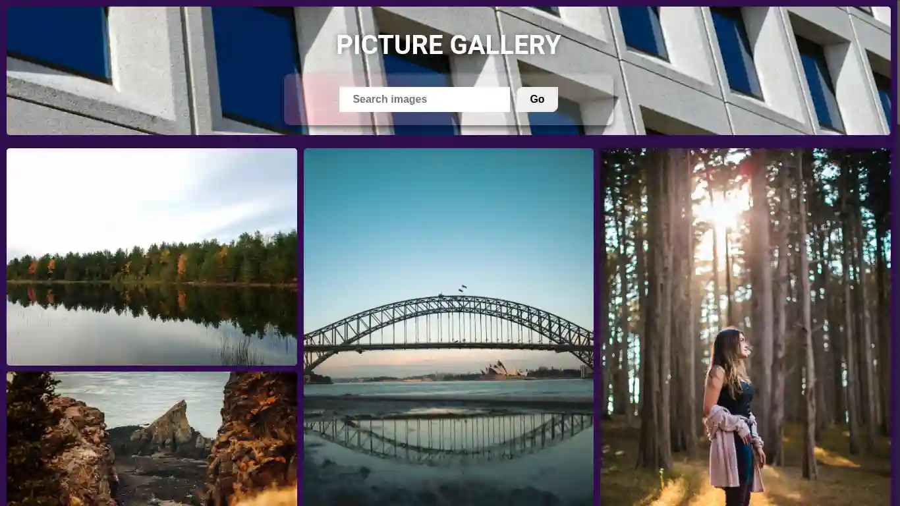

## 🇧🇷 Projeto de uma galeria de imagens aleatórias e pesquisas de imagens da plataforma Unsplash.com.

- #### 🇺🇸 Website of a random image gallery and image search.

#

### Access at: [Picture Gallery](https://picture-gallery-gray.vercel.app/).

 React

 TypeScript

 Unsplash API

### Author [Luiz Fernando](https://www.linkedin.com/in/lfoalves/).

#

###### Obs: Demo in HTML5 and Vanilla JS. The original project needs environment variables.
